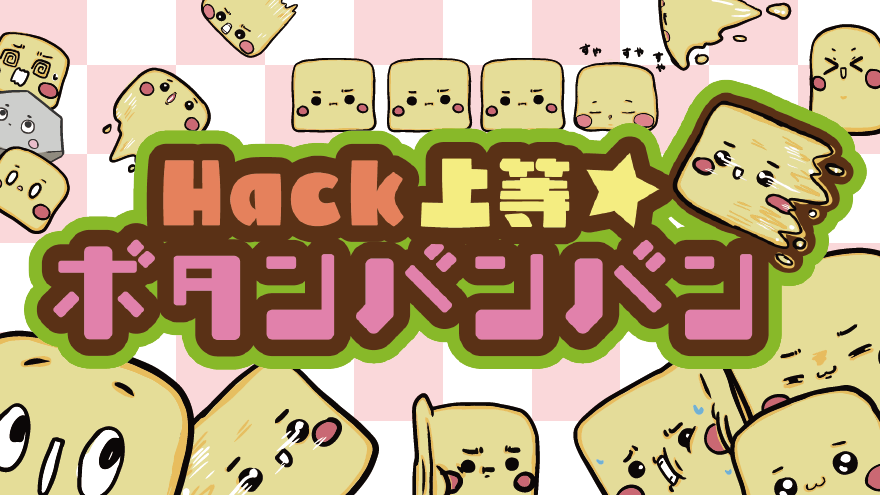

# button_banban
ハック上等★ボタンバンバン

# 説明URL（ProtoPedia）
https://protopedia.net/prototype/5445

# 説明
- STM32U5G9J-DK2で動作するゲームです。
- ゲーム内容などに関する詳細は説明URLを参照ください。

# ディレクトリ構成
- src
  - プログラムのファイルです。
  - TouchGFX + STM32CubeIDE でビルドしてください。
- img
  - 装飾用画像です。
